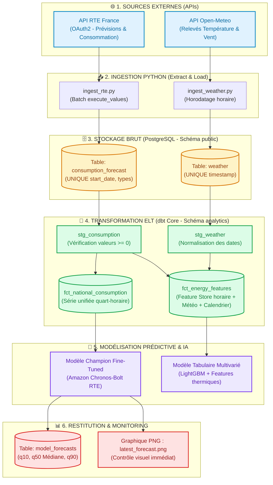
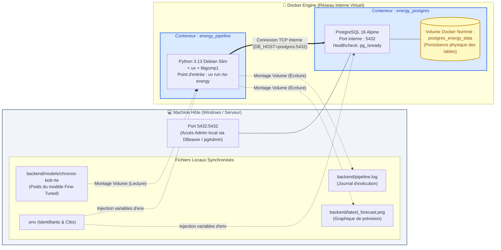
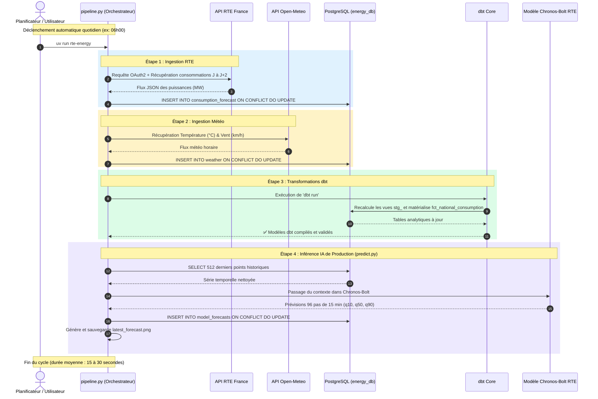
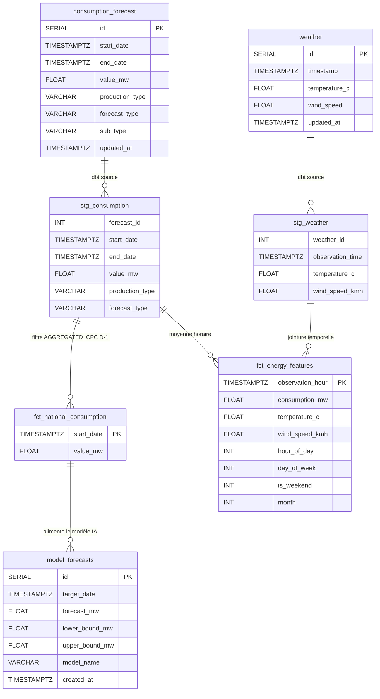
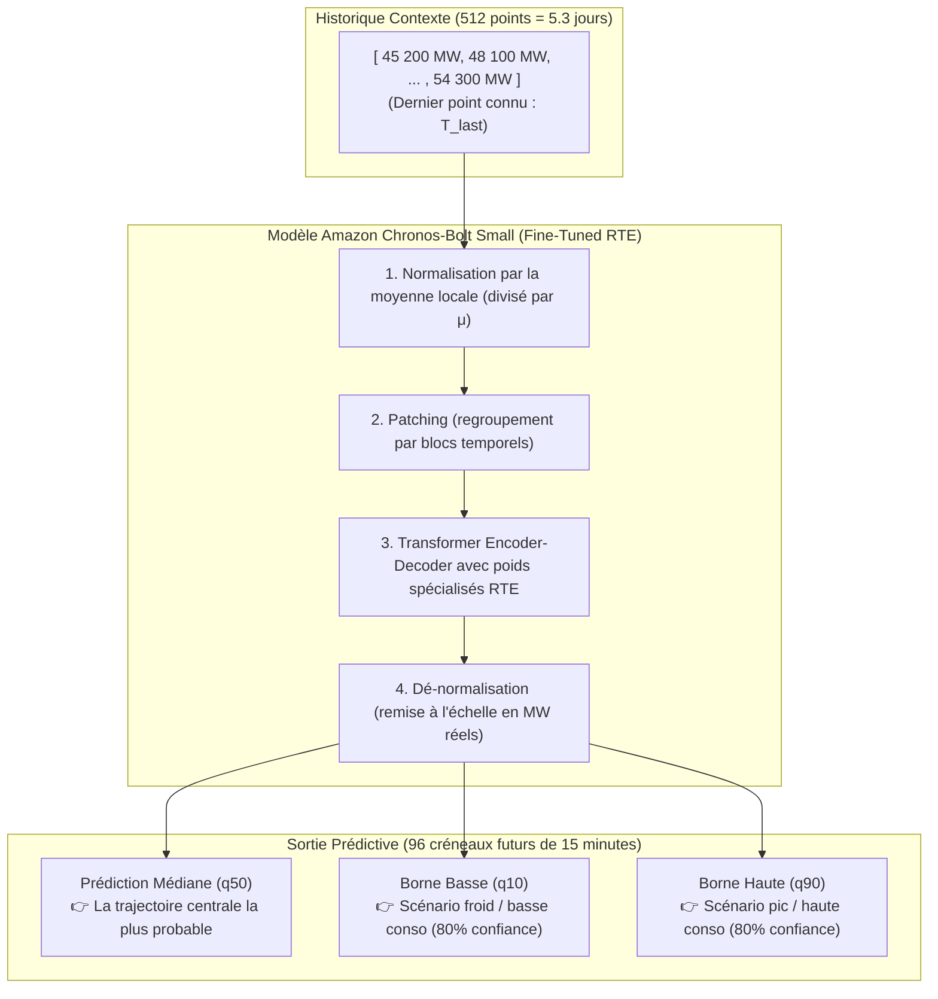

# 🏛️ Architecture Technique & Schémas Détaillés du Projet

Ce document présente l'architecture complète du projet **RTE Energy Pipeline & Inférence IA**, depuis la collecte de données brutes jusqu'au déploiement conteneurisé sous Docker.

---

## 📋 Table des Matières

1. [Vue d'Ensemble : Pipeline de Données & Inférence End-to-End](#1-vue-densemble--pipeline-de-données--inférence-end-to-end)
2. [Architecture Conteneurisée Docker (Services, Réseau & Volumes)](#2-architecture-conteneurisée-docker-services-réseau--volumes)
3. [Cycle de Vie Quotidien & Séquence d'Exécution (Orchestrateur)](#3-cycle-de-vie-quotidien--séquence-dexécution-orchestrateur)
4. [Schéma de Données (ELT & Modèles dbt)](#4-schéma-de-données-elt--modèles-dbt)
5. [Fonctionnement Interne du Module d'Inférence (`predict.py`)](#5-fonctionnement-interne-du-module-dinférence-predictpy)

---

## 1. Vue d'Ensemble : Pipeline de Données & Inférence End-to-End

Le flux suit les standards industriels de la **Modern Data Stack** (ELT : *Extract, Load, Transform*) couplée à une couche **MLOps** (*Machine Learning Operations*) :

---

## 2. Architecture Conteneurisée Docker (Services, Réseau & Volumes)

La conteneurisation isole le système complet dans deux conteneurs qui communiquent à travers un réseau privé virtuel interne (`bridge`) :

### 💡 Pourquoi cette organisation de volumes ?
1. **Poids du modèle (`./backend/models`) :** Le modèle fine-tuné pèse ~200 Mo. Au lieu de l'intégrer en dur dans l'image Docker (ce qui alourdirait le build à chaque modification de code), il est monté à la volée.
2. **Sorties (`pipeline.log`, `latest_forecast.png`) :** Dès que le conteneur calcule la prévision, le fichier image apparaît directement sur votre bureau Windows sans nécessiter de commande `docker cp`.
3. **Persistance (`postgres_energy_data`) :** Même si vous éteignez, recréez ou supprimez vos conteneurs, votre historique de données et vos prévisions ne sont **jamais perdus**.

---

## 3. Cycle de Vie Quotidien & Séquence d'Exécution (Orchestrateur)

Quand la commande `uv run rte-energy` (ou le conteneur Docker) démarre, l'orchestrateur [`pipeline.py`](file:///e:/Projects/QRA/rte_energie/backend/src/rte_energy/pipeline.py) exécute 4 étapes séquentielles :

---

## 4. Schéma de Données (ELT & Modèles dbt)

Le schéma ci-dessous illustre comment les données brutes sont transformées et reliées entre elles :

---

## 5. Fonctionnement Interne du Module d'Inférence (`predict.py`)

Comment le modèle **Chronos-Bolt Fine-Tuned** transforme le passé en prévisions futures :

---

*Document d'architecture généré pour le projet RTE Energy Pipeline.*
