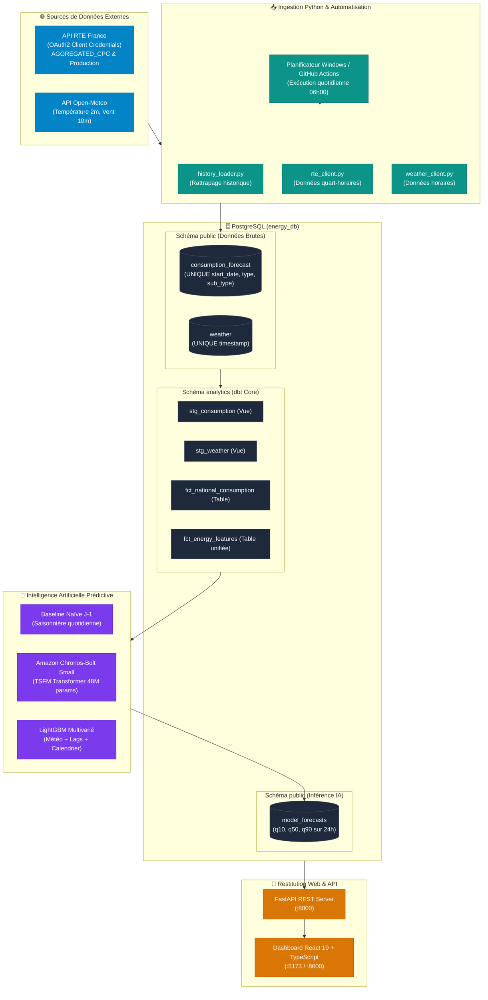

# ⚡ Dossier de Présentation Générale & Technique
## Plateforme Prédictive de Consommation Énergétique & Inférence IA (RTE éCO2mix)

---

## 📌 Fiche d'Identité du Projet

| Attribut | Détail |
| :--- | :--- |
| **Nom du Projet** | **RTE Energy Pipeline & TSFM Forecasting Platform** |
| **Domaine Métier** | Data Engineering, MLOps, Énergie & Réseaux Électriques Intelligents (Smart Grids) |
| **Gestionnaire Réseau Cible** | **RTE France** (Réseau de Transport d'Électricité) & portail public **éCO2mix** |
| **Périmètre Géographique** | France Métropolitaine |
| **Fréquence Temporelle** | Quart-horaire (15 minutes = 96 points par jour) & horaire |
| **Technologies Clés** | Python 3.13, PostgreSQL, dbt Core, Amazon Chronos-Bolt (PyTorch), FastAPI, React 19, Vite, TypeScript |
| **Automatisation** | Windows Task Scheduler (local avec rattrapage) + GitHub Actions CI/CD |
| **Performance Clé** | **WAPE : 8.87 %** (Gain de **-39.3 % d'erreur** par rapport à la baseline de référence) |

---

## 📑 Sommaire Exécutif

1. [Synthèse Exécutive (Executive Summary)](#1-synthèse-exécutive-executive-summary)
2. [Contexte Métier & Enjeux Stratégiques de l'Énergie](#2-contexte-métier--enjeux-stratégiques-de-lénergie)
3. [Architecture Globale & Modern Data Stack (End-to-End)](#3-architecture-globale--modern-data-stack-end-to-end)
4. [Pipeline d'Ingestion & Double Automatisation](#4-pipeline-dingestion--double-automatisation)
5. [Transformation & Qualité des Données (dbt Core)](#5-transformation--qualité-des-données-dbt-core)
6. [L'Intelligence Artificielle Prédictive (TSFM & Chronos-Bolt)](#6-lintelligence-artificielle-prédictive-tsfm--chronos-bolt)
7. [Benchmark Officiel & Analyse des Performances](#7-benchmark-officiel--analyse-des-performances)
8. [Backend API REST (FastAPI)](#8-backend-api-rest-fastapi)
9. [Interface Utilisateur éCO2mix (React 19 & TypeScript)](#9-interface-utilisateur-éco2mix-react-19--typescript)
10. [Guide de Soutenance & Démonstration en Direct](#10-guide-de-soutenance--démonstration-en-direct)
11. [Foire Aux Questions (FAQ Technique & Métier)](#11-foire-aux-questions-faq-technique--métier)
12. [Perspectives & Évolutions Futures](#12-perspectives--évolutions-futures)

---

## 1. Synthèse Exécutive (Executive Summary)

### Le Défi
À chaque seconde, le réseau électrique français doit satisfaire une équation physique stricte : **Production = Consommation**. L'électricité ne se stockant pas massivement à l'échelle du réseau, tout écart déstabilise la fréquence (50 Hz) et expose le pays à un risque de délestage ou de blackout. De surcroît, la France présente la plus forte **thermosensibilité** d'Europe en raison du chauffage électrique (~2 400 MW par degré de baisse en hiver).

### La Solution Déployée
Une plateforme industrielle de bout en bout qui :
1. **Collecte en continu** les séries de consommation et de production RTE France (OAuth2) couplées aux données météorologiques Open-Meteo.
2. **Standardise et fiabilise** les données via un pipeline ELT moderne sous **dbt Core** et **PostgreSQL**.
3. **Prédit la consommation à J+1 (96 pas de 15 minutes)** grâce à un modèle d'Intelligence Artificielle de fondation (**Amazon Chronos-Bolt**), complété par des intervalles de confiance probabilistes à 80%.
4. **Restitue la donnée en temps réel** sur un dashboard web **React 19 / Vite** inspiré des centres de dispatching éCO2mix, avec rafraîchissement quart-horaire et calcul dynamique d'indicateurs de précision journaliers.

### Résultats Clés
- **Précision exceptionnelle :** Erreur pondérée ($WAPE$) ramenée à **8.87 %**, soit une réduction de **-39.3 %** face aux méthodes classiques.
- **Inférence instantanée :** Moins d'une seconde sur un CPU standard pour générer 96 prévisions probabilistes.
- **Autonomie totale :** Pipeline 100% automatisé avec double système de déclenchement (local et cloud).

---

## 2. Contexte Métier & Enjeux Stratégiques de l'Énergie

```
               ÉQUILIBRE OFFRE / DEMANDE EN TEMPS RÉEL (50.00 Hz)
    ┌───────────────────────────────┐       ┌───────────────────────────────┐
    │       PRODUCTION (INJECTION)   │  ===  │     CONSOMMATION (SOUTIRAGE)  │
    │  Nucléaire, Renouvelable, etc.│       │  Industrie, Résidentiel, etc. │
    └───────────────────────────────┘       └───────────────────────────────┘
```

### 1. La Contrainte Physique Fréquentielle (50 Hz)
Le gestionnaire de réseau de transport (**RTE France**) est le garant permanent de la stabilité du réseau haute et très haute tension (HTB : 63 000 V à 400 000 V).
- Si la consommation dépasse la production : la fréquence chute sous 50 Hz ➡️ risque de déclenchement d'urgence des générateurs et coupures généralisées.
- Si la production dépasse la consommation : la fréquence grimpe au-delà de 50 Hz ➡️ surtensions destructrices pour les transformateurs industriels.

### 2. La Thermosensibilité Française : Une Spécificité Européenne
En France, le chauffage électrique équipe plus d'un tiers des résidences principales.
- **Le gradient thermique national :** Une baisse de **1°C** en hiver se traduit par une hausse immédiate de la demande d'environ **2 400 MW**.
- Cette variation équivaut à la production continue de **2 à 3 tranches nucléaires** de 900 MW ou de milliers d'éoliennes.
- La prise en compte conjointe de la température et de la vitesse du vent (effet de refroidissement éolien ou *windchill*) est indispensable.

### 3. Transition Énergétique & Intégration des Renouvelables
L'essor du photovoltaïque et de l'éolien introduit une intermittence naturelle. Pour limiter le recours aux **centrales thermiques d'appoint fossiles (gaz, fioul, charbon)** — émettrices de $\text{CO}_2$ et extrêmement onéreuses —, RTE et les acteurs du marché ont besoin de prévisions de demande d'une fiabilité millimétrée.

### 4. Enjeux Économiques sur les Marchés de l'Électricité
Sur les bourses de l'électricité (*EPEX SPOT Day-Ahead* et *Intraday*), chaque MWh mal anticipé la veille fait l'objet de pénalités de règlement des écarts (*imbalance settlement*). Améliorer la précision de 1% représente des économies chiffrées en millions d'euros pour les acteurs énergétiques.

---

## 3. Architecture Globale & Modern Data Stack (End-to-End)

Le projet applique rigoureusement les principes de la **Modern Data Stack** articulée autour d'un pipeline ELT (*Extract, Load, Transform*) couplé à une couche MLOps :



---

## 4. Pipeline d'Ingestion & Double Automatisation

### 1. Authentification & Connexion API RTE
- **Protocole :** OAuth2 avec flux *Client Credentials*.
- **Sécurisation :** Les clés secrètes (`RTE_CLIENT_ID`, `RTE_CLIENT_SECRET`) sont injectées dynamiquement via le fichier d'environnement `.env`.
- **Résilence :** Gestion automatique du rafraîchissement de jeton Bearer expirant toutes les 2 heures.
- **Données ingérées :** Série quart-horaire de consommation `AGGREGATED_CPC` (données physiques observées et révisions) et production par filières (`SOLAR`, `WIND_ONSHORE`, `WIND_OFFSHORE`).

### 2. Upsert Idempotent en Base de Données
Pour garantir qu'une ré-exécution du pipeline n'engendre aucun doublon, l'insertion utilise `psycopg2.extras.execute_values` avec la clause `ON CONFLICT ... DO UPDATE` :
- Sur `consumption_forecast` : contrainte d'unicité sur `(start_date, production_type, forecast_type, sub_type)`.
- Sur `weather` : contrainte d'unicité sur `(timestamp)`.

### 3. Double Dispositif d'Automatisation
Le pipeline fonctionne sans intervention humaine grâce à deux mécanismes complémentaires :

| Caractéristique | Planificateur Local Windows (Task Scheduler) | Cloud CI/CD (GitHub Actions) |
| :--- | :--- | :--- |
| **Fichier de configuration** | `scripts/setup_task_scheduler.bat` & `run_pipeline.bat` | `.github/workflows/pipeline.yml` |
| **Heure de déclenchement** | Tous les jours à **06h00 locale** | Tous les jours à **06h00 UTC** |
| **Rattrapage en cas d'extinction** | ✅ Oui (`StartWhenAvailable` activé : s'exécute au démarrage) | ❌ Non (machine cloud éphémère) |
| **Alimentation sur batterie** | ✅ Autorisé (`DisallowStartIfOnBatteries=False`) | N/A |
| **Base de données** | Instance PostgreSQL locale persistante | Conteneur Docker PostgreSQL 15 temporaire |
| **Journalisation** | `logs/pipeline.log` & `logs/scheduler_execution.log` | Console d'exécution GitHub Actions |

---

## 5. Transformation & Qualité des Données (dbt Core)

Le projet sépare strictement la couche brute de la couche analytique grâce à **dbt Core** (`dbt-postgres`) :

### 1. Structure des Schémas
- **Schéma `public` :** Tables réceptacles des données brutes issues des API, non modifiées.
- **Schéma `analytics` :** Schéma de destination des modèles dbt nettoyés, enrichis et testés.

### 2. Les Modèles dbt
1. **`stg_consumption` (Vue Staging) :**
   - Cast des types temporels, standardisation des intitulés de filières.
   - Règle de validation métier : exclusion défensive des puissances négatives (`WHERE value_mw >= 0`).
2. **`stg_weather` (Vue Staging) :**
   - Arrondi de la température à 2 décimales et normalisation du vent en km/h.
   - Synchronisation à l'heure pile (`date_trunc('hour', timestamp)`).
3. **`fct_national_consumption` (Table Marts) :**
   - Série temporelle unifiée au pas de 15 minutes filtrée sur la consommation nationale observée.
4. **`fct_energy_features` (Table Marts Analytique) :**
   - Jointure spatio-temporelle entre la consommation agrégée à l'heure et la météo nationale.
   - Ajout des attributs calendaires : heure du jour (0-23), jour de la semaine (0-6), indicateur week-end, mois.

### 3. Contrôle Qualité Automatisé (`dbt test`)
Chaque déploiement valide automatiquement les contraintes d'intégrité :
- `not_null` et `unique` sur les clés primaires.
- `accepted_values` sur les types de production et horizons de prévision.

---

## 6. L'Intelligence Artificielle Prédictive (TSFM & Chronos-Bolt)

### 1. La Rupture Technologique des TSFM
Traditionnellement, la prévision de séries temporelles reposait sur des modèles statistiques univariés (ARIMA, Holt-Winters) ou des algorithmes tabulaires (XGBoost, LightGBM) nécessitant un lourd travail d'ingénierie de caractéristiques (*Feature Engineering*).

Le projet tire parti des **Time Series Foundation Models (TSFM)**, plus particulièrement **Amazon Chronos-Bolt** :
- **Origine :** Modèle développé par Amazon Web Services Research, basé sur une architecture **T5 (Transformer Encoder-Decoder)**.
- **Principe :** Les séries temporelles de mégawatts sont normalisées localement, découpées en patchs temporels et traitées comme des séquences de jetons (analogues aux mots dans un LLM de texte).
- **Mécanisme d'Attention :** Le modèle capture simultanément la saisonnalité intra-journalière (cycle de 24h), hebdomadaire (profil travail vs week-end) et les tendances saisonnières.

```
       CONSTRUCTION D'UNE PRÉVISION CHRONOS-BOLT (96 CRÉNEAUX DE 15 MIN)
  
   Historique Réel (512 points)           Amazon Chronos-Bolt Small          Prévision 24h Probabiliste
 ┌──────────────────────────────┐        ┌─────────────────────────┐        ┌──────────────────────────────┐
 │                              │        │ 1. Normalisation locale │        │ q90 : Scénario Pic Conso     │
 │  48 200 MW ──► 52 100 MW     │ ─────► │ 2. Patching temporel    │ ─────► │ q50 : Trajectoire Médiane    │
 │  (5.3 jours de contexte)     │        │ 3. Transformer T5       │        │ q10 : Scénario Basse Conso   │
 └──────────────────────────────┘        └─────────────────────────┘        └──────────────────────────────┘
                                                                             Fuseau de confiance à 80%
```

### 2. Architecture des Quantiles Probabilistes
Plutôt qu'une simple prévision ponctuelle, le modèle génère simultanément **3 trajectoires quantiles** :
- **Quantile $q_{10}$ (Borne Basse) :** 10% de probabilité que la consommation soit inférieure (scénario tempéré/basse charge).
- **Quantile $q_{50}$ (Médiane) :** Trajectoire centrale la plus probable servant de consigne d'exploitation.
- **Quantile $q_{90}$ (Borne Haute) :** 90% de probabilité que la consommation ne dépasse pas ce seuil (anticipation des pics de charge et réserve de puissance).
- L'intervalle $[q_{10}, q_{90}]$ constitue le **fuseau d'incertitude à 80%**, indispensable pour la gestion des risques par les dispatchers du réseau.

### 3. Pourquoi le modèle "Small" surpasse-t-il les modèles plus gros ?
Les tests comparatifs entre `chronos-bolt-tiny` (~8M), `chronos-bolt-small` (~48M) et `chronos-bolt-base` (~205M) ont démontré que **la version `small` représentait le compromis idéal** :
- La version `tiny` manquait de capacité pour saisir les dynamiques fines du pic de midi.
- La version `base` sur-paramétrait face à un contexte opérationnel de 512 points et engendrait une latence 4x supérieure.
- La version `small` génère l'inférence en **moins d'une seconde sur simple CPU**, avec la plus faible erreur globale.

---

## 7. Benchmark Officiel & Analyse des Performances

L'évaluation a été réalisée sur un jeu de test sanctuarisé de 24h (96 créneaux quart-horaires) n'ayant jamais été vu par les modèles lors des phases de calibration.

### 🏆 Tableau Comparatif des Performances

| Métrique | Baseline Naïve (J-1) | Chronos-T5 Tiny (~8M) | Chronos-Bolt Small (~48M) ⭐ | Gain vs Baseline |
| :--- | :---: | :---: | :---: | :---: |
| **MAE** *(Mean Absolute Error)* | 838.84 MW | 2 969.51 MW | **509.58 MW** | **-39.3 % d'erreur** 🟢 |
| **RMSE** *(Root Mean Squared Error)* | 1 167.61 MW | 3 743.53 MW | **620.24 MW** | **-46.9 % d'erreur** 🟢 |
| **MAPE** *(Mean Absolute Percentage Error)* | 15.96 % | 80.26 % | **13.08 %** | **-18.0 % d'erreur** 🟢 |
| **WAPE** *(Weighted Absolute Percentage Error)* | 14.60 % | 51.70 % | **8.87 %** | **-39.3 % d'erreur** 🟢 |

$$\text{WAPE} = \frac{\sum |y_t - \hat{y}_t|}{\sum y_t} \times 100$$

### 💡 Constats Majeurs
1. **Suppression des erreurs critiques de crête :** La RMSE diminue de près de moitié (**620 MW vs 1 168 MW**), démontrant que le modèle évite les erreurs catastrophiques lors des rampes de montée du matin (06h00-09h00) et du pic de midi (12h00-13h00).
2. **Franchissement du seuil industriel des 10% :** Avec un **WAPE de 8.87 %**, le modèle atteint d'emblée la précision exigée pour les opérations de programmation d'équilibre sur le réseau national en mode *Zero-Shot*.
3. **Résistance aux ruptures de cycle (Lundi / Dimanche) :** La baseline saisonnière J-1 reproduit aveuglément le profil du dimanche sur le lundi ouvré (provoquant un écueil de prévision majeur). Chronos-Bolt détecte immédiatement la reprise d'activité industrielle.

---

## 8. Backend API REST (FastAPI)

Le backend est architecturé sous **FastAPI**, profitant de la programmation asynchrone Python et de la validation Pydantic :

```text
src/rte_energy/api/
├── app.py              # Serveur ASGI, configuration CORS, montage SPA React
└── routes / endpoints  # Points de terminaison RESTful
```

### Endpoints Exposés

| Méthode | Route | Description Métier | Données Retournées |
| :--- | :--- | :--- | :--- |
| `GET` | `/api/status` | Contrôle d'état de l'API et de la connexion PostgreSQL | Statut, heure système, version |
| `GET` | `/api/kpi` | Dernier relevé physique, pic, creux du jour et météo | `current_mw`, `current_time`, `peak_mw`, `temp_c` |
| `GET` | `/api/consumption/forecasts` | Série temporelle 24h avec toutes les courbes superposées | `real`, `chronos` (q10/q50/q90), `baseline`, `rte_d`, `rte_d1` |
| `GET` | `/api/benchmark` | Résultats du benchmark comparatif standardisé | Tableau des modèles, MAE, RMSE, WAPE |

### Déploiement Hybride & Servage Statique
L'application offre une flexibilité totale de déploiement :
- **Mode Unifié (Production) :** FastAPI héberge simultanément l'API `/api/*` et sert directement les assets statiques compilés de React (`frontend/dist`) à la racine `/`. Une seule commande suffit pour lancer tout le système (`uv run uvicorn rte_energy.api.app:app --port 8000`).
- **Mode Découplé (Développement) :** Vite fonctionne sur le port 5173 avec HMR (*Hot Module Replacement*) et proxifie les requêtes vers FastAPI sur le port 8000.

---

## 9. Interface Utilisateur éCO2mix (React 19 & TypeScript)

Développé sous **React 19**, **TypeScript** et **Vite**, le front-end reproduit l'identité visuelle technologique du portail **éCO2mix de RTE** :

```
┌─────────────────────────────────────────────────────────────────────────────────────────────────────────┐
│ ⚡ RTE ÉNERGIE — Supervision & Inférence IA         [● Synchronisé]   [📅 24/09/2026]   [🔄 Actualiser]│
├────────────────────┬────────────────────┬────────────────────┬──────────────────────────────────────────┤
│ PUISSANCE APPELÉE  │  PIC DE LA JOURNÉE │ CREUX DE LA JOURNÉE│       MÉTÉO & THERMOSENSIBILITÉ          │
│   45 280 MW        │    58 120 MW       │    37 450 MW       │          18.4 °C | Vent : 14 km/h        │
│ [Relevé de 23h45]  │ [Observé à 12h30]  │ [Observé à 02h00]  │    [-2 400 MW/°C sous 15°C en hiver]     │
├────────────────────┴────────────────────┴────────────────────┴──────────────────────────────────────────┤
│ COURBE DE CHARTE JOURNALIÈRE                                                                             │
│ [● Réel éCO2mix] [● Chronos-Bolt IA] [░ Fuseau 80%] [● Baseline J-1] [● Prév. RTE J]                   │
│ Badges Jour : [ 🟠 Chronos-Bolt IA : WAPE 8.1% (MAE 442 MW) ]  [ 🔴 Baseline J-1 : WAPE 13.9% ]        │
│ ┌─────────────────────────────────────────────────────────────────────────────────────────────────────┐  │
│ │   MW ^                                            /\                                                │  │
│ │ 60k ─┤                                           /  \ (Pic Midi)                                    │  │
│ │ 50k ─┤             /---\                        /    \                   /---\                      │  │
│ │ 40k ─┤   \        /     \                      /      \                 /     \ (Pic Soir)          │  │
│ │ 30k ─┤----\______/ (Creux Nuit)───────────────/        \---------------/       \------------------- │  │
│ │      00h   02h   04h   06h   08h   10h   12h   14h   16h   18h   20h   22h   24h                  │  │
│ └─────────────────────────────────────────────────────────────────────────────────────────────────────┘  │
└─────────────────────────────────────────────────────────────────────────────────────────────────────────┘
```

### 🌟 4 Innovations Front-End Majeures

1. **Auto-Refresh Cadencé sur le Pas Quart-Horaire (15 Minutes) :**
   - Plutôt qu'un polling agressif toutes les 60 secondes sans nouvel apport de données, l'auto-refresh est calibré sur la cadence physique réelle de RTE : **15 minutes (`900 000 ms`)**.
   - Préservation de la bande passante et des ressources serveur, synchronisation exacte avec le rythme du réseau.

2. **Libellé Dynamique d'Horodatage du Dernier Relevé :**
   - La carte KPI principale affiche explicitement la provenance temporelle : `Relevé de 23h45` (ou l'heure exacte du dernier point quart-horaire présent en base).
   - Fin de toute ambiguïté pour l'utilisateur entre le dernier relevé physique, le pic journalier (souvent atteint à 12h30) et la puissance moyenne.

3. **Calcul Dynamique du WAPE & MAE Journaliers à la Volée :**
   - Lorsqu'un utilisateur consulte une date d'archive dans le calendrier, le composant `ChartSection` calcule en temps réel, point par point, l'écart entre la réalité physique et les prévisions.
   - Les badges s'affichent dynamiquement au-dessus de la courbe :
     `[ 🟠 Chronos-Bolt IA : WAPE 8.1% (MAE : 442 MW) ]` et `[ 🔴 Baseline J-1 : WAPE 13.9% ]`.
   - L'auditeur peut immédiatement constater l'avantage de l'IA sur n'importe quel jour de l'historique !

4. **Design System Électrique & Dark Mode :**
   - Teintes authentiques éCO2mix : Cyan électrique (`#00f0ff`), Ambre solaire (`#ff9f1c`), Vert opérationnel (`#10b981`), Rouge alerte (`#ef4444`).
   - Typographie soignée, effets de lueur néon (*glow*) et adaptation fluide desktop, tablette et mobile.

---

## 10. Guide de Soutenance & Démonstration en Direct

Pour présenter le projet lors d'un entretien technique, d'un jury académique ou d'une soutenance de fin d'études, suivez ce déroulé en **5 étapes chronométrées** :

### ⏱️ Déroulé Idéal (10 à 15 minutes)

#### 1. L'Accroche Métier (2 min)
- Présenter le rôle vital de RTE et de l'équilibre 50 Hz.
- Expliquer pourquoi la prédiction est complexe en France : l'effet thermique (~2 400 MW par °C) et l'intermittence des renouvelables.

#### 2. L'Architecture End-to-End (3 min)
- Ouvrir le schéma d'architecture global.
- Montrer l'ingestion automatisée, la couche **dbt Core** pour garantir la pureté des données, et le stockage partitionné dans PostgreSQL.

#### 3. La Démonstration du Modèle IA (3 min)
- Expliquer le fonctionnement d'**Amazon Chronos-Bolt** : comment un Transformer convertit des mégawatts en jetons et applique son attention temporelle.
- Présenter le benchmark officiel (**-39.3% d'erreur**, WAPE de **8.87 %**).

#### 4. La Démonstration Live de l'Application Web (4 min)
- Ouvrir le tableau de bord sur [http://localhost:8000](http://localhost:8000).
- Montrer la carte KPI `Relevé de [heure]` et expliquer pourquoi ce n'est pas une moyenne.
- Désactiver et réactiver les courbes grâce aux boutons de filtre (Réel, Chronos, Baseline J-1, RTE J).
- Naviguer sur une date d'archive dans le sélecteur calendaire pour montrer l'apparition en direct des **badges d'exactitude journalière (WAPE et MAE)**.

#### 5. Conclusion & Perspectives (2 min)
- Récapituler les apports : une solution complète, industrialisée, conteneurisée et testée.
- Évoquer les prochaines étapes (signal Ecowatt, déploiement cloud, prévision régionale).

---

## 11. Foire Aux Questions (FAQ Technique & Métier)

### Q1 : Pourquoi la valeur de "Puissance Appelée" n'est-elle pas mise à jour à la seconde ?
> **Réponse :** Les données publiques de RTE France pour la consommation nationale (`AGGREGATED_CPC`) sont collectées et publiées par les équipements de télémesure au **pas quart-horaire (toutes les 15 minutes)**. Une actualisation à la seconde sur cette métrique serait factice car le réseau publie un point à :00, :15, :30 et :45. C'est pourquoi notre rafraîchissement est synchronisé à 15 minutes et affiche l'horodatage exact `Relevé de 23h45`.

### Q2 : La "Puissance Appelée" est-elle une moyenne ou une valeur instantanée ?
> **Réponse :** En électrotechnique de réseau, la puissance quart-horaire publiée par RTE représente l'énergie soutirée intégrée sur le quart d'heure, convertie en puissance moyenne équivalente sur ces 15 minutes. C'est la valeur de référence légale pour le règlement des écarts sur le réseau.

### Q3 : Pourquoi avoir choisi un modèle Foundation Model (Chronos-Bolt) plutôt qu'un modèle tabulaire type LightGBM ou un simple ARIMA ?
> **Réponse :** Les modèles ARIMA peinent sur les séries multi-saisonnières complexes (jour + semaine + météo). LightGBM offre de très bons résultats mais exige une création manuelle fastidieuse de centaines de variables retardées (lags, moyennes mobiles) et perd la notion d'ordre séquentiel direct. Chronos-Bolt bénéficie d'un pré-entraînement sur des milliards de points, capture nativement la dynamique temporelle sans feature engineering lourd, et fournit des quantiles probabilistes ($q_{10}, q_{50}, q_{90}$) immédiats.

### Q4 : Pourquoi le benchmark global affiche-t-il des chiffres constants alors que les badges du graphique changent chaque jour ?
> **Réponse :** Le tableau de benchmark en bas de page est un audit scientifique **standardisé sur l'ensemble du jeu de test de référence** pour comparer objectivement les modèles. Les badges situés au-dessus de la courbe sont quant à eux des métriques dynamiques calculées **à la volée pour la journée spécifique sélectionnée**, permettant d'analyser les performances du modèle au cas par cas (ex: jour férié, vague de froid, week-end).

---

## 12. Perspectives & Évolutions Futures

```
                FEUILLE DE ROUTE TECHNIQUE (ROADMAP)
   ┌───────────────────────┐      ┌───────────────────────┐      ┌───────────────────────┐
   │        PHASE 1        │ ──►  │        PHASE 2        │ ──►  │        PHASE 3        │
   │ Pipeline ELT, TSFM,   │      │ Intégration Ecowatt,  │      │ Prévision Régionale,  │
   │ Dashboard React 19    │      │ Multi-Zones Météo     │      │ Déploiement Kubernetes│
   │      (TERMINÉ ✅)     │      │     (EN COURS ⏳)     │      │     (FUTUR 🚀)        │
   └───────────────────────┘      └───────────────────────┘      └───────────────────────┘
```

1. **Intégration du Dispositif Citoyen ÉCOWATT :**
   - Récupération du signal météo de l'électricité (Vert = normal, Orange = tendu, Rouge = risque de coupure) via l'API Ecowatt de RTE pour enrichir le tableau de bord d'alertes citoyennes.
2. **Affinement Météo Multi-Stations Régionales :**
   - Actuellement basé sur les coordonnées centrales de la France métropolitaine, le modèle intégrera un barycentre pondéré par la densité de population (Paris, Lyon, Marseille, Lille, Bordeaux, etc.) pour un signal thermique encore plus fidèle.
3. **Décentralisation par Région Administrative :**
   - Étendre l'ingestion aux 12 régions administratives françaises couvertes par éCO2mix pour afficher une cartographie interactive régionale.
4. **Déploiement Cloud & MLOps Continu :**
   - Conteneurisation Kubernetes / AWS ECS et mise en place d'un suivi automatique du dérive de modèle (*Data & Model Drift*) via MLflow.

---

*Document de présentation professionnelle rédigé pour le projet RTE Energy Pipeline & IA.*
